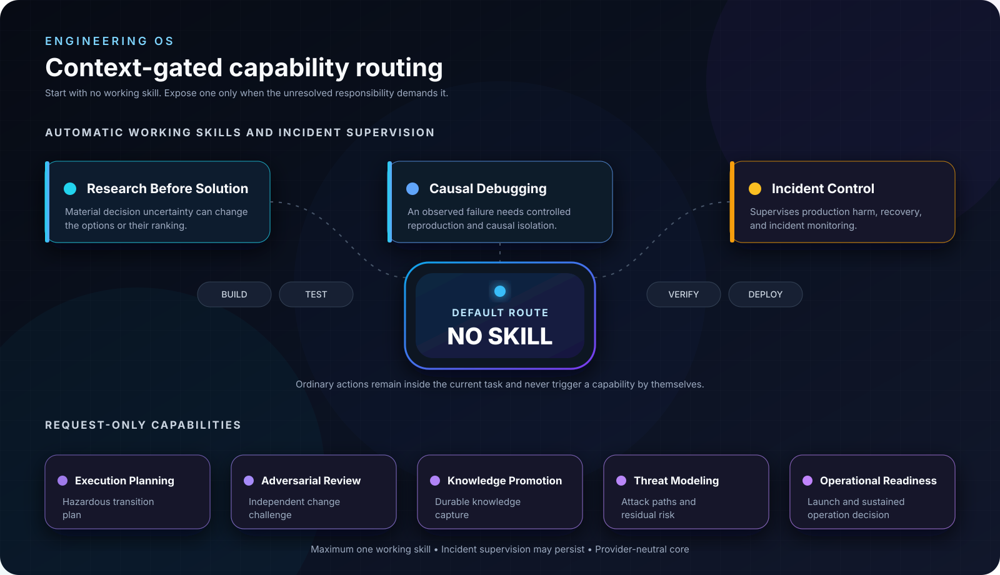

# Engineering OS


Engineering OS is a provider-neutral, evidence-gated capability suite for AI engineering agents.
It makes no skill the default, exposes specialized methods only when their distinctive responsibility is necessary, and requires claims to match available evidence.

Version 4.9.0 contains fifteen specialized skills.
Routine implementation and proportional verification are baseline agent behavior, not an installable skill.
The foundational capability remains `research-before-solution`, which blocks solution options until decision-relevant research is complete.

Engineering OS defines world-class capability by distinct responsibility, precise activation, expert method, evidence discipline, useful verdicts, safe composition, and bounded context cost.
Contract fixtures preserve those boundaries, while field evidence records how the system behaves in real use.

## Agent discovery model

```text
default: no skill

automatic working skills, maximum one:
  research-before-solution
  causal-debugging

automatic supervisory context during an active incident:
  incident-control

request-only working skills, maximum one:
  execution-planning
  adversarial-review
  acceptance-review
  story-splitting
  reduce-system-complexity
  requirements-hardening
  secure-oauth-oidc
  knowledge-promotion
  technical-communication
  threat-modeling
  operational-readiness
  testing

ordinary execution:
  inspect -> edit -> build -> test -> verify -> package -> run -> deploy
  no skill activation unless the unresolved responsibility changes
```



Installed skills are discovered through their `SKILL.md` descriptions.
The description is the agent-facing discovery and activation contract.

## Included skills

| Skill | Activation | Sole responsibility |
| --- | --- | --- |
| [`research-before-solution`](skills/research-before-solution/SKILL.md) | Automatic when material decision uncertainty exists | Establish decision-sufficient truth, analyze structural consequences when relevant, then present evidence-grounded options. |
| [`causal-debugging`](skills/causal-debugging/SKILL.md) | Automatic for an observed failure needing causal isolation | Establish the smallest defensible causal chain. |
| [`incident-control`](skills/incident-control/SKILL.md) | Automatic supervisory context during active production harm or recovery | Control harm, preserve command, supervise bounded working skills, and verify recovery. |
| [`execution-planning`](skills/execution-planning/SKILL.md) | Request-only | Design a safe transition when material execution hazards remain. |
| [`adversarial-review`](skills/adversarial-review/SKILL.md) | Request-only | Independently challenge a defined change and report supported findings. |
| [`acceptance-review`](skills/acceptance-review/SKILL.md) | Request-only | Prove criterion-by-criterion whether an implementation satisfies one authoritative contract. |
| [`story-splitting`](skills/story-splitting/SKILL.md) | Request-only | Split a broad outcome into independently valuable vertical child stories. |
| [`reduce-system-complexity`](skills/reduce-system-complexity/SKILL.md) | Request-only | Establish or verify a net reduction of mechanism while conserving accepted behavior. |
| [`requirements-hardening`](skills/requirements-hardening/SKILL.md) | Request-only | Turn product intent or an existing requirement artifact into explicit, testable behavior without inventing owner decisions. |
| [`secure-oauth-oidc`](skills/secure-oauth-oidc/SKILL.md) | Request-only | Design or assess end-to-end OAuth and OpenID Connect security invariants against current primary standards. |
| [`knowledge-promotion`](skills/knowledge-promotion/SKILL.md) | Request-only | Promote verified learning into the strongest appropriate durable artifact. |
| [`technical-communication`](skills/technical-communication/SKILL.md) | Request-only | Turn verified technical material into an accurate, reader-centered artifact using human language without losing necessary precision. |
| [`threat-modeling`](skills/threat-modeling/SKILL.md) | Request-only | Model credible attack paths, control evidence, and explicitly owned residual risk for a defined security scope. |
| [`operational-readiness`](skills/operational-readiness/SKILL.md) | Request-only | Decide whether a defined system or release can operate, degrade, and recover under named ownership. |
| [`testing`](skills/testing/SKILL.md) | Request-only | Decide whether tests provide meaningful behavior evidence and identify justified retention, strengthening, consolidation, replacement, or removal. |

## Evidence before solutions


The research gate treats model memory as a source of hypotheses rather than evidence.
It requires the owning path, material boundaries, competing explanations, contradictions, and remaining uncertainty to be understood before solution construction begins.

## Why ordinary work uses no skill

Building, testing, verifying, packaging, running containers, and executing an established deployment procedure are actions inside ordinary execution.
They are not separate engineering responsibilities and do not justify loading a methodology.

Universal behavior remains concise in `global-agents.md`:

- inspect before consequential claims or changes;
- preserve unrelated work;
- verify proportionally;
- never report checks that did not complete successfully;
- communicate evidence and limitations honestly.

## Quick start

Requirements:

- Bash 3.2 or newer;
- `sha256sum` or `shasum`;
- an agent host that discovers `SKILL.md` packages.

Install all fifteen skills for agent discovery, which is the default:

```bash
./scripts/install.sh --agents keep
```

Install only the three narrowly automatic skills when reduced discoverability is explicitly required:

```bash
./scripts/install.sh --profile automatic --agents keep
```

Install an exact subset:

```bash
./scripts/install.sh \
  --skills research-before-solution,adversarial-review \
  --agents keep
```

Install only the optional global policy and no skills:

```bash
./scripts/install.sh --profile none --agents replace
```

Preview operations without changing files:

```bash
./scripts/install.sh --profile automatic --agents replace --dry-run
```

Skills install to `~/.agents/skills` by default.
Use `--skills-target` for another host's discovery directory.
The optional policy installs to `~/.agents/AGENTS.md` only when explicitly selected.

## Provider neutrality

The portable core contains no provider-specific agent metadata.
Each skill contains only `SKILL.md` and directly related references.
Host-specific adapters may be developed separately, but they are not required by or embedded in the capability definitions.

The default `full` profile installs every skill so agents can discover the appropriate capability from its description.
The `automatic`, `custom`, and `none` profiles are explicit controls for environments that need a smaller discoverable set.

## Install or update

Refresh an installation while preserving its recorded profile:

```bash
./scripts/install.sh --agents keep
```

Pass `--profile` or `--skills` to change the exposed capability set deliberately.
The current manifest is authoritative, and unknown skill names are rejected before target changes.
The update path reconciles removed managed skills safely and stops before changes when managed content has been modified.
Use `--replace-modified` to back up changed managed skills and replace them with packaged versions explicitly.

## Version 4.9 changes

- Version 4.9.0 adds the request-only `testing` capability for explicit test design and test-suite quality decisions.
- The testing capability installs concrete behavior, factory, coverage-theater, mutation, execution-scope, and organization examples as required runtime guidance.
- The universal policy now requires tests to prove behavior through the public interface at the layer named by the claim.
- New installations expose all fifteen canonical skills for discovery, while the explicit automatic profile remains limited to three.

## Uninstall

```bash
./scripts/uninstall.sh
```

The uninstaller removes only unchanged managed skills.
It preserves modified skills and safely restores pre-existing content from backups.

## Validate the package

Run structural and portability validation:

```bash
./scripts/validate.sh
```

Run installer profile and lifecycle smoke checks:

```bash
./scripts/test.sh
```

These checks validate package structure, routing, contract coverage, and installer behavior.
See [Evaluation](docs/evaluation.md) for contract-fixture and field-evidence guidance.

## Repository map

```text
skills/             Fourteen provider-neutral capability packages
routing.yaml        Maintainer-only routing inventory and validation fixture
scripts/            Profile-aware install, update, uninstall, and validation
docs/               Architecture, orchestration, installation, and evaluation
evals/              Trigger, no-skill, handoff, restraint, and end-to-end contract fixtures
benchmark/          Optional field-observation dimensions and scenarios
global-agents.md    Optional minimal universal policy
manifest.yaml       Version, capability inventory, and default exposure set
skills.md           Human-readable capability routing map
assets/             README graphics
```

## Contributing

Read [Contributing](docs/contributing.md) before changing a skill.
Add or retain a skill only when it owns a valuable responsibility that baseline behavior, global policy, or an existing skill does not already own.
Keep contract fixtures synchronized with activation, restraint, verdict, authority, and handoff changes.

## License

Engineering OS is available under the [MIT License](LICENSE).
