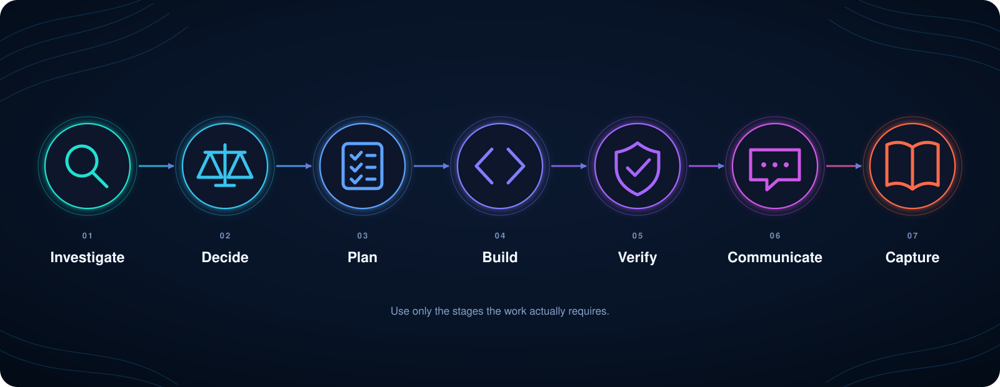

# Engineering OS


Engineering OS gives AI coding agents ten reusable skills for investigating systems, making decisions, planning risky work, implementing carefully, reviewing results, communicating clearly, and preserving durable knowledge.

It is designed for coding agents that discover `SKILL.md` packages from `~/.agents/skills` and can optionally use a global `AGENTS.md`.

## Quick start

You need Git, Bash, and either `sha256sum` or `shasum`.

```bash
git clone https://github.com/sageil/engineering-os.git
cd engineering-os
./scripts/install.sh --agents keep
```

The command installs all ten skills and leaves your global `AGENTS.md` unchanged.

Successful installation ends with:

```text
Installed Engineering OS 3.0.0 with 10 skills.
```

To install the optional global policy as well, run:

```bash
./scripts/install.sh --agents replace
```

The installer backs up an existing policy before replacing it.

## Why Engineering OS

AI agents can generate code quickly.
Engineering work also requires understanding unfamiliar systems, testing explanations, comparing alternatives, controlling risk, reviewing changes, and retaining what was learned.

Engineering OS turns those responsibilities into focused skills instead of one large prompt.
Each skill is independently discoverable and is intended to load only when its activation conditions apply.

The shared principles are straightforward:

- Inspect reality before making consequential changes.
- Treat explanations and solutions as hypotheses until evidence supports them.
- Prefer the smallest justified solution.
- Make risky work observable and reversible.
- Attempt to falsify results before claiming success.
- Preserve reusable knowledge in the strongest appropriate artifact.

## How the skills work together



`Investigate → Decide → Plan → Build → Verify → Communicate → Capture`

Not every task needs every stage.
A small local change may need only implementation and review, while an incident or migration may use most of the lifecycle.
See [orchestration](docs/orchestration.md) for common routes.

## Included skills

| Skill | Responsibility |
| --- | --- |
| [Engineering Investigation](skills/engineering-investigation/SKILL.md) | Establish what is true and reduce material uncertainty before acting. |
| [Engineering Decision](skills/engineering-decision/SKILL.md) | Compare credible alternatives and choose the strongest practical action. |
| [Engineering Planning](skills/engineering-planning/SKILL.md) | Establish an evidence-backed plan and define a safe, observable, and reversible execution strategy. |
| [Engineering Quality](skills/engineering-quality/SKILL.md) | Implement, simplify, test, and adversarially verify production changes. |
| [Engineering Debugging](skills/engineering-debugging/SKILL.md) | Find the smallest causal explanation consistent with the evidence. |
| [Architecture and Reliability](skills/architecture-reliability/SKILL.md) | Evaluate boundaries, resilience, operability, security, performance, and long-term cost. |
| [Incident Response](skills/incident-response/SKILL.md) | Protect users and restore safe service while preserving evidence and control. |
| [Engineering Review](skills/engineering-review/SKILL.md) | Attempt to disprove correctness, safety, maintainability, and merge readiness. |
| [Engineering Communication](skills/engineering-communication/SKILL.md) | Transfer an accurate mental model with minimal ambiguity and cognitive load. |
| [Engineering Memory](skills/engineering-memory/SKILL.md) | Preserve durable decisions and lessons without accumulating stale context. |

## Install and manage

The default installer is interactive and asks whether to keep or replace the global policy.
For scripts and CI, choose the behavior explicitly.

| Command | Result |
| --- | --- |
| `./scripts/install.sh` | Install all skills and choose the global-policy behavior interactively. |
| `./scripts/install.sh --agents keep` | Install all skills without changing the global policy. |
| `./scripts/install.sh --agents replace` | Install all skills and safely replace the global policy. |
| `./scripts/install.sh --agents replace --dry-run` | Preview the complete installation without changing files. |
| `./scripts/update.sh --agents keep` | Refresh managed skills while leaving the global policy unchanged. |
| `./scripts/uninstall.sh` | Remove unchanged managed files, restore backups, and preserve user modifications. |

Custom locations are available through `--skills-target` and `--agents-target`.
See the [installation guide](docs/installation.md) for examples and recovery behavior.

### Safety behavior

- Pre-existing skills and global policy files are backed up before replacement.
- Managed skills are checksummed so updates stop instead of overwriting local edits.
- Post-installation modifications are preserved during uninstall.
- Installation state and backups live under `~/.agents/.engineering-os` by default.

## Repository map

```text
skills/             Installable skill packages and their evaluations
scripts/            Install, update, uninstall, validation, and smoke checks
docs/               Installation, orchestration, customization, and evaluation guides
evals/              Cross-skill and end-to-end behavior scenarios
benchmark/          Judgment benchmark dimensions and sample scenarios
global-agents.md    Optional global Engineering OS policy
manifest.yaml       Package metadata and canonical skill list
```

## Documentation

- [Installation](docs/installation.md) covers paths, policy choices, backups, and uninstall behavior.
- [Orchestration](docs/orchestration.md) explains when skills should work together.
- [Customization](docs/customization.md) explains where project-specific rules belong.
- [Evaluation](docs/evaluation.md) describes trigger, behavior, and cross-skill evaluation.
- [Contributing](docs/contributing.md) defines the evidence expected for changes.
- [Validation](VALIDATION.md) records the package and smoke checks.

## Project checks

```bash
./scripts/validate.sh
./scripts/test.sh
```

## License

Engineering OS is available under the [MIT License](LICENSE).
