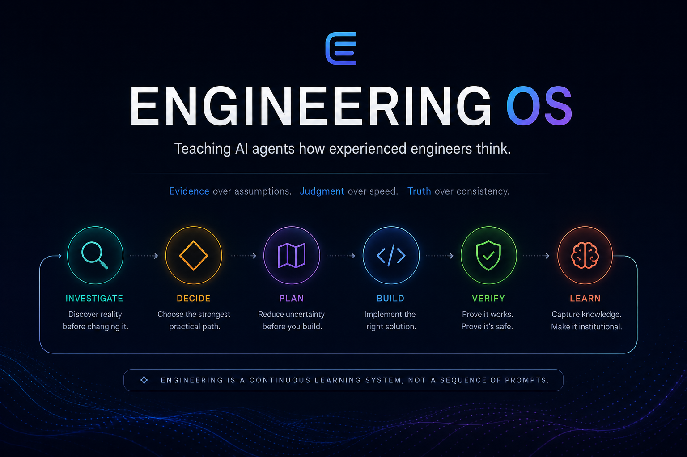
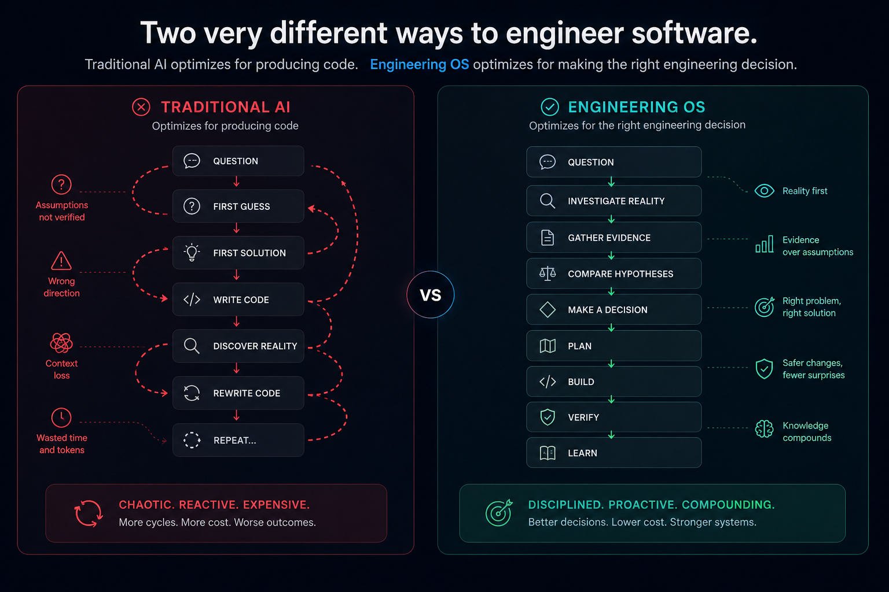
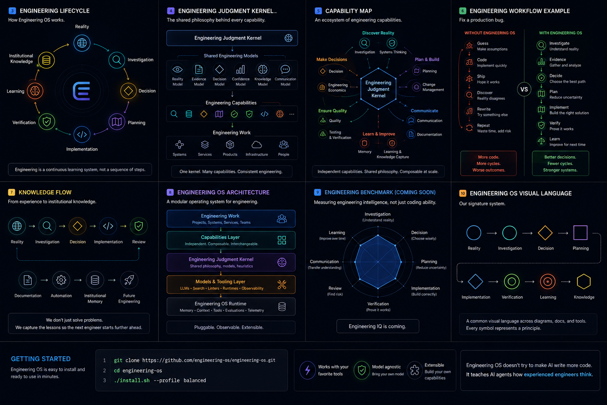
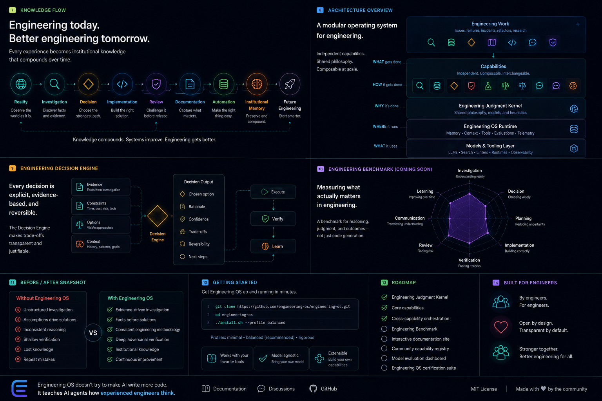
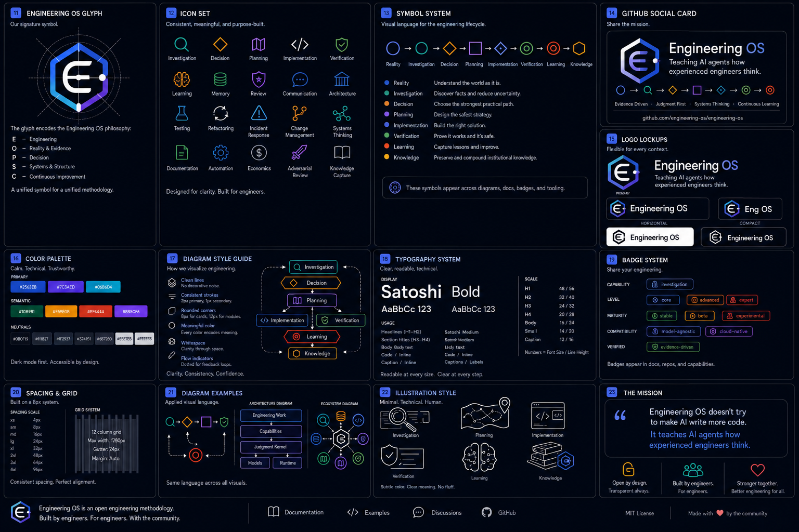

<p align="center">
  
</p>

<h1 align="center">Engineering OS</h1>

<p align="center"><strong>Teaching AI agents how experienced engineers think.</strong></p>

<p align="center">
Engineering OS is an open engineering methodology that turns AI coding agents from code generators into evidence-driven engineering collaborators.
</p>

<p align="center">
  <a href="#getting-started">Get Started</a> ·
  <a href="#the-method">The Method</a> ·
  <a href="#capabilities">Capabilities</a> ·
  <a href="#architecture">Architecture</a> ·
  <a href="#roadmap">Roadmap</a>
</p>

---

## AI can write code.

That is not the hard part.

The hard part is engineering.

Coding agents often start before they understand the system, treat assumptions as facts, commit to the first plausible solution, and declare success after shallow verification. With standalone skills, you are still largely at the mercy of the model: whether it investigates, compares alternatives, challenges itself, or remembers what matters can vary from one task to the next.

Engineering OS makes those behaviours part of a repeatable engineering process.

<p align="center">
  
</p>

---

## The method

Engineering OS gives agents a shared methodology instead of a loose collection of prompts.

Every task moves through the same disciplined lifecycle:

**Investigate → Decide → Plan → Build → Verify → Communicate → Learn**

The sequence is adaptive, not bureaucratic. Small, obvious work stays small. Ambiguous or consequential work receives deeper investigation, planning, and verification.

<p align="center">
  
</p>

---

## One philosophy. Every capability.

Every capability inherits the same Engineering Judgment Kernel:

- Reality over intuition.
- Evidence over assumptions.
- Truth over consistency.
- Judgment over speed.
- Reversibility over cleverness.
- Systems over components.
- Humans over optimization.
- Learning over remembering.

The shared philosophy keeps the capabilities consistent, while explicit handoffs guide agents to the next responsible capability.

---

## Capabilities

Engineering OS is made of ten independent, composable capabilities with explicit handoffs between them.

| Capability | Governing question |
|---|---|
| Engineering Investigation | What is actually true, and what system effects matter? |
| Engineering Decision | What is the strongest practical choice over its lifetime? |
| Engineering Planning | What is the safest executable path from here to there? |
| Engineering Quality | How should the change be built, simplified, tested, and verified? |
| Engineering Debugging | What causal explanation fits every observation? |
| Architecture and Reliability | Will this remain healthy, operable, resilient, and economical? |
| Incident Response | What is the safest next action while users or systems are at risk? |
| Engineering Review | Can the proposed or completed change be shown to be unsafe? |
| Engineering Communication | How do we transfer the correct mental model? |
| Engineering Memory | What knowledge should survive, and where should it live? |

Each capability declares where it is usually entered from and which capability normally takes responsibility next. Agents use only the smallest route required by the task and return to an earlier capability when new evidence invalidates the current path.

---

## From prompting to engineering

Prompt engineering tells a model what to do.

Skill engineering teaches a model a task.

Engineering OS gives the model a coherent engineering methodology—shared principles, decision gates, evidence standards, verification habits, and learning loops.

That produces more consistent outcomes across models because the process no longer depends entirely on whatever reasoning pattern the model happens to use in the moment.

---

## Architecture

Engineering OS is layered like an operating system:

1. **Engineering Work** — bugs, features, migrations, incidents, refactors, research.
2. **Capabilities** — focused engineering disciplines that compose as needed.
3. **Engineering Judgment Kernel** — shared principles and reasoning models.
4. **Models & Tooling** — LLMs, search, linters, runtimes, observability.
5. **Runtime Services** — memory, context, evaluations, profiles, and telemetry.

<p align="center">
  
</p>

---

## Engineering compounds

Engineering OS does not stop when the code works.

The result of each task can become stronger system knowledge:

**Observation → Investigation → Decision → Implementation → Review → Documentation → Automation → Institutional Memory**

The best lessons move into their strongest home: code, tests, CI, documentation, runbooks, decision records, or memory. The system improves instead of repeating the same mistakes.

---

## A production bug, two outcomes

### Without Engineering OS

1. Guess the cache is broken.
2. Rewrite the cache.
3. Run shallow tests.
4. Discover production still fails.
5. Start over.

### With Engineering OS

1. Establish the observed behaviour.
2. Generate credible competing hypotheses.
3. Inspect repository and runtime evidence.
4. Disprove incorrect explanations.
5. Choose the smallest justified correction.
6. Verify the fix adversarially.
7. Capture the reusable lesson in the right artifact.

The difference is not more ceremony. It is less rework and better decisions.

---

## Getting started

```bash
git clone https://github.com/sageil/engineering-os.git
cd engineering-os
./scripts/install.sh --profile balanced
```

The installer is interactive and guides you through the setup.

Engineering OS installs its capabilities into the standard agent skills directory:

```text
~/.agents/
├── AGENTS.md                    # optional global policy and routing
├── .engineering-os/
│   ├── install-state.env        # ownership and restoration metadata
│   └── backups/                 # pre-installation files and skills
└── skills/
    ├── engineering-investigation/
    ├── engineering-decision/
    ├── engineering-planning/
    ├── engineering-quality/
    ├── engineering-debugging/
    ├── architecture-reliability/
    ├── incident-response/
    ├── engineering-review/
    ├── engineering-communication/
    └── engineering-memory/
```

The Engineering OS global policy, `~/.agents/AGENTS.md`, is optional. The installer asks whether you want to keep your existing file or replace it with the Engineering OS policy.

```text
Engineering OS detected an existing AGENTS.md.

Choose an option:

1. Keep my existing AGENTS.md
2. Replace it with Engineering OS
3. Preview the Engineering OS version
4. Cancel

Default: Keep existing
```

The default is always to preserve the existing file.

When you explicitly choose replacement, the installer:

- creates a timestamped backup before writing
- records installation state and checksums
- writes the new file atomically
- preserves the original backup across upgrades
- enables safe restoration during uninstall

Your original `AGENTS.md` is never silently discarded.

### Installation profiles

Profiles control how strongly Engineering OS shapes agent behaviour.

| Profile | Description |
|---|---|
| Lightweight | Essential investigation, quality, and review. |
| Balanced | The complete recommended methodology for most engineering work. |
| Strict | All capabilities plus the global routing policy for stronger always-on gates. |

### Installation layout

Engineering OS keeps its installation simple and visible.

```text
~/.agents/
├── AGENTS.md                    # optional global policy
├── .engineering-os/
│   ├── install-state.json       # ownership and restoration metadata
│   └── backups/                 # pre-installation AGENTS.md backups
└── skills/
    ├── engineering-investigation/
    ├── engineering-decision/
    ├── engineering-economics/
    ├── plan-gate/
    ├── engineering-quality/
    ├── debugging/
    ├── testing/
    ├── refactoring/
    ├── architecture-review/
    ├── systems-thinking/
    ├── incident-response/
    ├── change-management/
    ├── engineering-communication/
    ├── adversarial-code-review/
    ├── engineering-memory/
    └── learning-and-knowledge-capture/
```

The skills directory is installed by default. Replacing the global policy always requires explicit consent.

### Common installation commands

```bash
# Interactive installation
./scripts/install.sh --profile balanced

# Install skills without changing AGENTS.md
./scripts/install.sh --profile balanced --agents keep

# Explicitly replace AGENTS.md after backing it up
./scripts/install.sh --profile balanced --agents replace

# Preview all planned changes
./scripts/install.sh --profile balanced --agents replace --dry-run
```

### Updating

Running the installer again upgrades Engineering OS in place.

Existing skills are updated safely. If Engineering OS manages your global `AGENTS.md`, the installer preserves the original pre-installation backup across upgrades.

When the current file still matches the version installed by Engineering OS, it can be updated normally. When it has been edited since installation, the installer stops and asks what to do instead of overwriting those changes.

### Uninstalling

Engineering OS can be removed cleanly at any time.

```bash
./scripts/uninstall.sh
```

The uninstaller removes only files recorded as belonging to Engineering OS.

If Engineering OS replaced your global `AGENTS.md` and the installed file has not changed, the original file is restored automatically.

If the file has been edited since installation, the uninstaller asks whether to keep it, or preserve the edited version as another backup before restoring the pre-installation state. You can also cancel the uninstall.

The default is to keep the current file. Engineering OS never silently destroys post-installation edits.

```bash
# Non-interactive uninstall while preserving the current AGENTS.md
./scripts/uninstall.sh --agents keep

# Explicitly restore the pre-installation AGENTS.md
./scripts/uninstall.sh --agents restore
```

When `--agents restore` is used against a modified file, the current version is backed up before restoration.

### Safe by design

The installation lifecycle is designed to be predictable and reversible:

- explicit consent for user-owned files
- safe defaults
- idempotent installation
- atomic file replacement
- timestamped backups
- checksum verification
- recorded installation ownership
- protection for post-installation edits
- clean uninstall and restoration
- dry-run support

---

## Model and tool agnostic

Engineering OS is designed to work across agents and harnesses that support durable instructions or discoverable skills. The methodology does not depend on one model, framework, language, or repository type.

Engineering OS installs as independently discoverable capabilities. Optionally, it can also install the Engineering OS global policy, `AGENTS.md`, to activate the Engineering Judgment Kernel across supported agents.

---

## Visual system

The included visual assets establish a shared language for the lifecycle, capabilities, kernel, architecture, and future benchmark.

<p align="center">
  
</p>

---

## Roadmap

Engineering OS is evolving toward a complete, model-agnostic engineering operating system for AI agents.

Planned work includes:

- broader agent and harness compatibility
- stronger behavioural evaluations and benchmarks
- capability-level conformance tests
- profile customization
- richer installation diagnostics
- reusable repository policies
- knowledge capture and promotion workflows
- telemetry that measures engineering quality rather than token output

---

## Contributing

Engineering OS is open by design.

Contributions should improve engineering judgment, not merely add more instructions. New capabilities must have a clear responsibility, inherit the shared kernel, avoid duplicating existing capabilities, and include evaluations that demonstrate real behavioural value.

---

## License

MIT

---

<p align="center">
  <strong>Engineering OS does not try to make AI write more code.</strong><br>
  It teaches AI agents how experienced engineers think.
</p>
