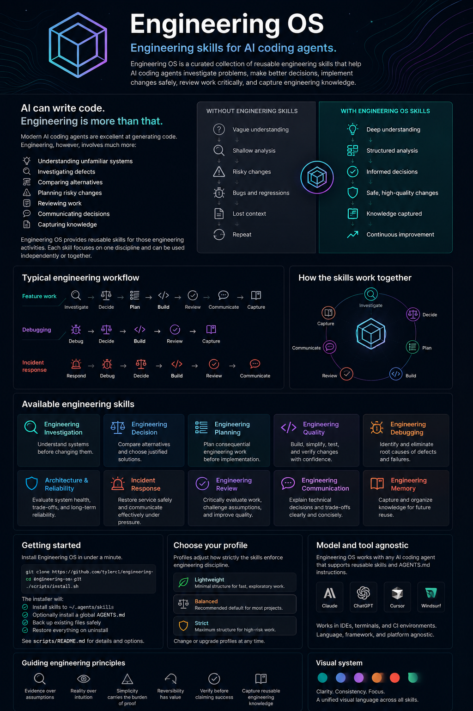

# Engineering OS



## Engineering skills for AI coding agents

Engineering OS is a curated collection of reusable engineering skills that help AI coding agents investigate systems, make better decisions, plan work, implement changes safely, debug problems, review work, communicate clearly, and capture engineering knowledge.

### Skills
- Engineering Investigation
- Engineering Decision
- Engineering Planning
- Engineering Quality
- Engineering Debugging
- Architecture & Reliability
- Incident Response
- Engineering Review
- Engineering Communication
- Engineering Memory

### Typical workflow
Investigate → Decide → Plan → Build → Review → Communicate → Capture Knowledge

### Installation
```bash
git clone https://github.com/sageil/engineering-os.git
cd engineering-os
./scripts/install.sh
```

The installer installs the skills into `~/.agents/skills`, optionally installs `AGENTS.md`, backs up existing files, and restores them during uninstall.

### Engineering principles
- Evidence over assumptions
- Reality over intuition
- Simplicity carries the burden of proof
- Prefer reversible changes
- Verify before claiming success
- Capture reusable engineering knowledge
